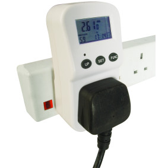

# Sustainabilty DIY

If you are interested in getting people involved hands-on in
collectively reducing electricty and waste, you've come to the right place!

This site will help you run your own project allow your family, school,
workplace or community to measure waste and electrcity, and to then compare how
they are doing against targets they've set by looking it graphs online or
printed out on noticeboards.

## Why?

We all know that our consumer society is using far more resources than we need,
and that the result is affecting the planet. So we need to live a little
lighter and the best way to understand how to do that is to measure things and
see their impact!

If you run a project, your participants will:

* Learn first hand how your behaviour affects waste and electricity, so you are more aware of the impact your choices make

You might also:

* Reduce your waste and electricity costs

## Who?

Everyone can get involved in this, whether it is just you and your partner at
home, an office space, a classroom or an entire organisation.

Roles:

* [Co-ordinator](role-coordinator.md) - Reads these instructions, runs the first workshop and keeps the project ticking along
* [Tech person](role-tech-person.md) - Can copy the template spreadsheet and teach other how to add data to it, perhaps setting up one or two custom charts the group is interested in
* Waste data collector - Everyone can get involved in this!
* Electricity data collector - Everyone can get involved in this!
* [Analyser](role-analyser.md) - Puts the collected data into the spreadsheet and checks the charts make sense
* Publicist - Prints out the graphs each week and put them up on noticeboards, tweets about progress
* Presenter - Runs regular meetings to talk through progress and discuss new ways of meeting the targets (or whether the targets could be changed)

Permissions:

* Someone who knows where the electricity meter is, and can give permission for your participants to access it to make readings
* To convince whoever normally takes the waste out to weigh it first, or to convince them that you can weigh and take out the waste instead.

## What you'll need

* A Google account
* Scales (about £7)
* An electricity reader (about £10)
* A printer for the waste logs and report graphs

## How?

You'll run a workshop discussing sustainability, getting people to measure the
electricity usage of different devices, thinking about waste and discussing any
other interesting initiatives you've been involved in.

If people want to have a go at the project, you can collectively agree targets and then set it up!

Broadly speaking this involves:

* Copying the template spreadsheet
* Setting up different waste bins
* Recording data weekly into the spreadsheet
* Printing out the result graphs
* Regular events to discuss progress

The spreadsheet template will automatically create graphs you can put into a
document and print out, or embed into a blog or yout website for people to see
online.

The benefit of using a spreadsheet is that you can customise the approach
depending on what your community want to achive.

See the individual role instructions for more information.

### Electricity

You'll set up a rota, or choose a person to read the electricity meter *at the
same time* every week. They'll enter that value into the spreadsheet which will
automatically update the graph which can be printed out each week.

### Waste

You'll set up separate bins for:

* Landfill
* Compost
* Recycling

Then set up scales somewhere near the bins, and put the waste log on the wall
opposite.

Then each time a bin is full, you'll weigh it on the scales and write the mass
in the correct part of the waste log depending on whether the bag is compost,
recycling or landfill.

At the end of each week, empty any reasonably full bins (perhaps greater than
half full) and weight them too. Then add together all the values for each type
of waste so you have a single value for each. These values for landfill,
recycling and compost are then added to the spreadsheet which will
automatically update the graph which can be printed out each week.

The key to success is to keep it simple. If you are late recording data,
results for the graph the previous week might be larger than normal, and the
result for the next smaller than normal. That's OK as long as the graph is
properly labelled. Also, there might be waste in the bins that isn't weighed.
All these things can be discussed, and people will enjoy learning about (and
correcting) the potential flaws in the approach, so don't feel the need to hide
them! 

## Keeping it simple

Google charts are quite flexible, but likely won't allow you do everything you
want. That's OK. The idea is to get people involved, not to be perfect.
Everyone will learn by improving the system.

