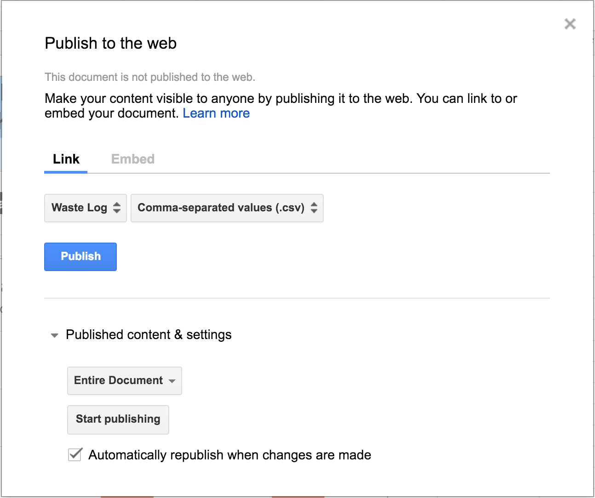
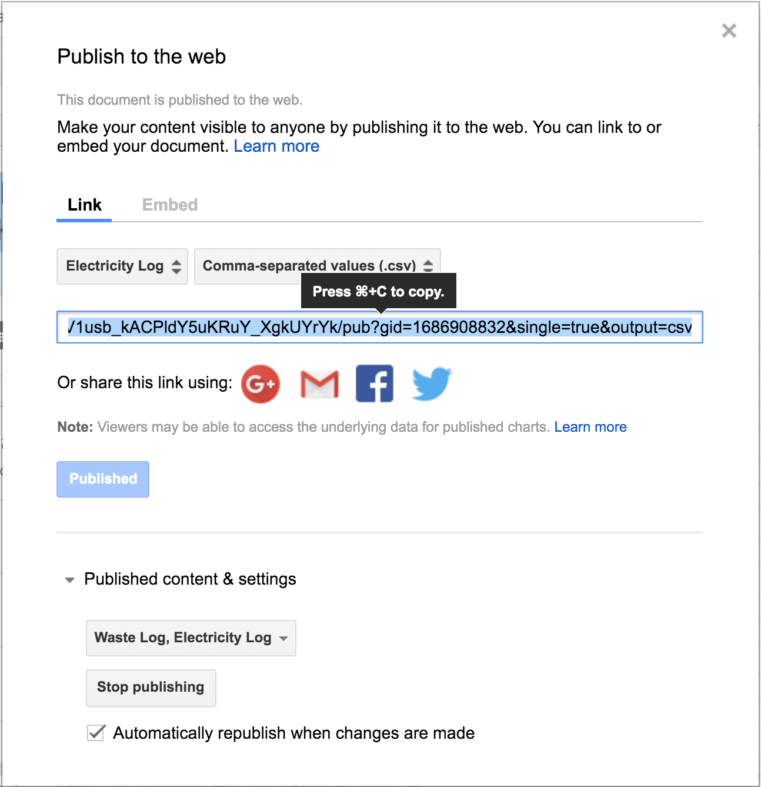
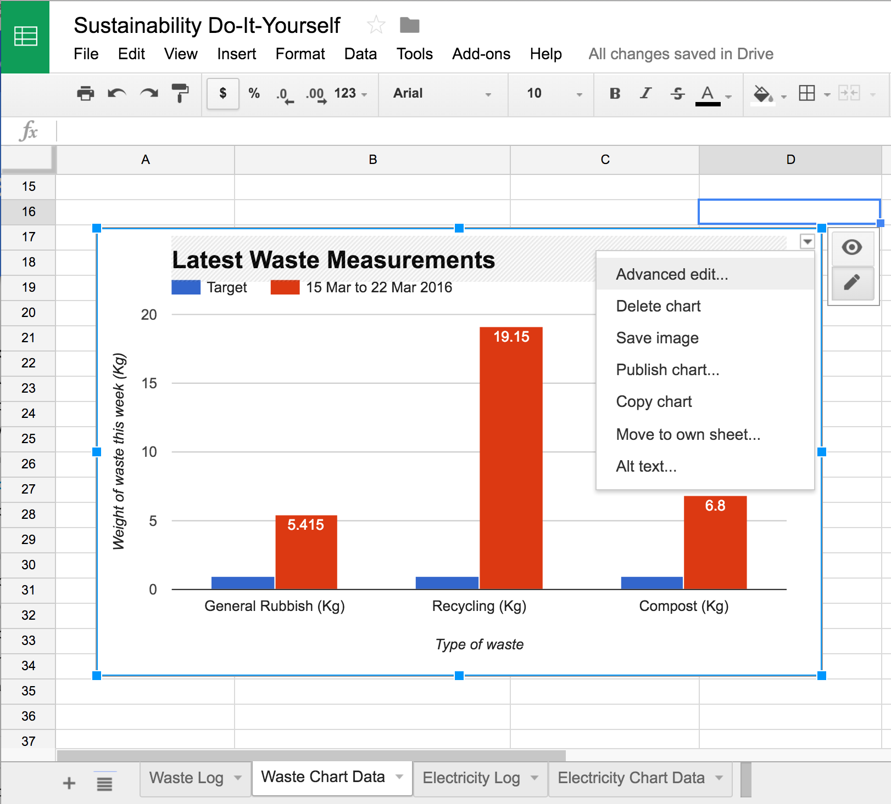
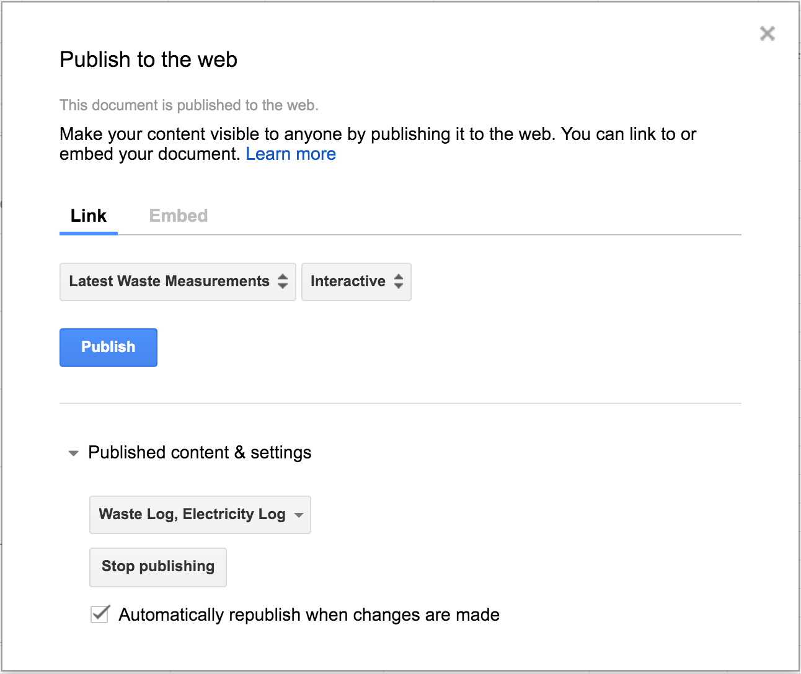
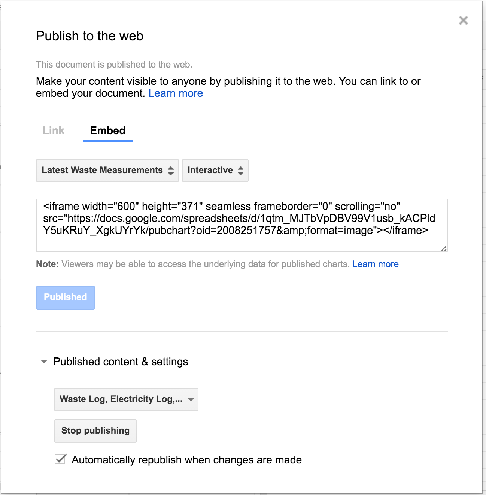

# Tech person

Welcome tech person. Your role on the team is to set up the template
spreadsheet, and make sure the chart creator knows how to use it proplery.

You should probably also read the guidance for the Analyser so you know what
they need to do, and for the Publicist so you know how they'll use the links
and embeds you create.

* [Analyser](role-analyser.md) - Puts the collected data into the spreadsheet
  and checks the charts make sense
* Publicist - Prints out the graphs each week and put them up on noticeboards,
  tweets about progress

So, to create a copy of the spreadsheet for your own use you'll need to:

* Visit the template spreadsheet at https://docs.google.com/spreadsheets/d/1qtm_MJTbVpDBV99V1usb_kACPldY5uKRuY_XgkUYrYk/edit#gid=0
* Choose `File -> Make a copy...` from the menu
* Give your copy a better name by clicking on the title and changing it
* Share the sheet with the Analyser by choosing `File -> Email
  collaborators...` from the menu and then entering their email address

At this point the data is ready to be accessed, but it isn't shared on the web
yet. Let's share both the sheet itself and all the charts publicly.

The information you'll collect as you publish on the web needs to be shared
with the Publicist so she can tell other people. There is a sample template
email at the end of this document you can fill out as you publish various parts
of the spreadsheet.

## Sharing CSV Files

Now, on to the sharing itself:

* Share the sheet publicly using `File -> Publish to the web...` from the menu.

* Keep `Link` selected at the top and the choose `Waste Log` and `Comma-separated
  values (.csv)`. Now click `Publish` and make a note of the URL that is
  produced.

  

  The link is where people can download the *source data* the team
  have collected. Comma-separated values (.csv) files can be loaded by
  OpenOffice (free), Excel and other spreadsheet and database programs for
  further analysis.

  The template document example is:

  https://docs.google.com/spreadsheets/d/1qtm_MJTbVpDBV99V1usb_kACPldY5uKRuY_XgkUYrYk/pub?gid=0&single=true&output=csv

* Now change the drop down to `Electricty Log` and click `Publish` again:

  

  The template document example is:

  https://docs.google.com/spreadsheets/d/1qtm_MJTbVpDBV99V1usb_kACPldY5uKRuY_XgkUYrYk/pub?gid=1686908832&single=true&output=csv

## Sharing Charts

There are three ways Google let's you share a chart, and it is worth setting up all of them to use:

* An interactive chart which can be embedded in most other web pages or blogs
* An image which can be embedded in more restrictive web web pages or blogs
* A standalone, empty web page which people can visit in a browser, which you
  could link to from other web pages, twitter etc

For each one:

* Navigate to the correct tab (Waste Chart Data, then Electricity Chart Data)
* Click on the chart to select it. Then click on the drop down arrow in the top right:

  

* Choose `Publish to the web...` and you'll see this:

  

* The default is `Interactive`. Click `Publish` and make a note of the link:

  The template example URL is:

  https://docs.google.com/spreadsheets/d/1qtm_MJTbVpDBV99V1usb_kACPldY5uKRuY_XgkUYrYk/pubchart?oid=2008251757&format=interactive

* Now change `Interactive` to `Image` and make a note of the new URL for the image:

  The template example URL is:

  https://docs.google.com/spreadsheets/d/1qtm_MJTbVpDBV99V1usb_kACPldY5uKRuY_XgkUYrYk/pubchart?oid=2008251757&format=image

* Finally, click `Embed` and make a note of the embed code.

  

  An example template embed code is:

  ~~~
  <iframe width="600" height="371" seamless frameborder="0" scrolling="no" src="https://docs.google.com/spreadsheets/d/1qtm_MJTbVpDBV99V1usb_kACPldY5uKRuY_XgkUYrYk/pubchart?oid=2008251757&amp;format=image"></iframe>
  ~~~

Now repeat the above for the electricity graph.

## Notifing the Publicist and Analyst

At this point, you should get in touch with the Analyser and make sure that
they can enter data and that the URLs and embeds you are about to send to the
Publicist do update.

Now please send the email with all the information you've collected to the
Publicist.

That's it! Thanks for all your efforts.

If you are super keen, perhaps later you could set up one or two custom charts
the group is interested in as a result of subsequent feedback workshops?

## Sample Email Template

~~~
Dear Publicist,

I've set up a Google Sheet so that the Analyser can enter data.

I've created a public URL here where anyone can download the raw data as a
comma-separated values (.csv) file or CSV for short. CSV filescan be loaded by
OpenOffice (a free program), Excel and other spreadsheet and database programs
for further analysis, so you might want to share the link with other people who
might be interested. The link is this:

    [insert spreadsheet CSV link you generated here ...]

We've also got two charts which I've published. Each chart has three ways of
sharing it:

* An interactive chart which can be embedded in most other web pages or blogs
* An image which can be embedded in more restrictive web web pages or blogs
* A standalone, empty web page which people can visit in a browser, which you
  could link to from other web pages, twitter etc

Here are the codes you need for each ...

	Waste log

        Interactive chart (copy and paste this into the CMS editor):
            <iframe [insert interactive link here ...] ></iframe>
		Static image (use this as the image `src` attribute in your editor):
			
		Standalone web page:
			http://[insert full URL here]

	Electricity log

        Interactive chart (copy and paste this into the CMS editor):
            <iframe [insert interactive link here ...] ></iframe>
		Static image (use this as the image `src` attribute in your editor):
			
		Standalone web page:
			http://[insert full URL here]

I hope that all makes sense, feel free to contact me or the Co-ordinator if it doesn't.

Cheers,

Tech Person
~~~
